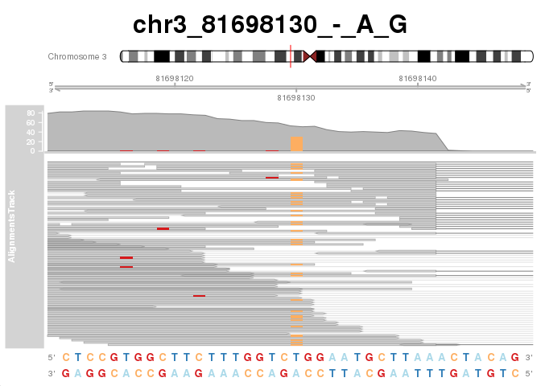
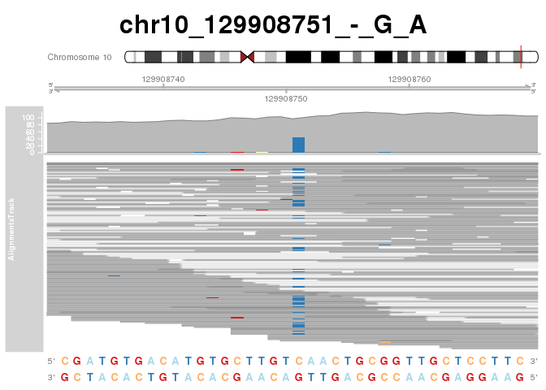

# Motivation

These set of packages comprises many different parts of the process of genomic 
analysis. As these packages are all built with R, we can avoid the use of secondary
packages and programming environments. And as most of them are maintained through
the Bioconductor project, these packages are expected to work robustly and
updated in a coordinated manner.

# Setup


```r
# Cores to be used when parallel is used
nCores <- 10
```

## Packages

The packages we are going to introduce

```r
library(GenomicRanges)
library(GenomicAlignments)
library(Gviz)
library(magrittr)
library(BSgenome.Hsapiens.UCSC.hg19)
library(ggplot2)
```

## Functions

A group of custom functions

```r
ggBarplot <- function(x, ci = NA, title = NULL, subt = NULL, xLab = "Names", yLab = "Values"){
    if(is.null(names(x))){names(x) <- 1:length(x)}
    df <- data.frame(names = factor(names(x), levels = names(x)), value = x, CI = ci)
    outGG <- ggplot(data=df, aes(x=names, y=value)) + 
        geom_bar(stat="identity") + theme_classic() + 
        geom_errorbar(aes(ymin=value-CI, ymax=value+CI), width=.2, position=position_dodge(.9)) + 
        theme(axis.text.x = element_text(angle = 90, hjust = 1)) + ggtitle(title, subt) +
        ylab(yLab) + xlab(xLab)
    return(outGG)
}
```

# GenomicRanges

## Basic construction and usage

GenomicRanges are built over a package called IRanges. Implements an algebra of 
range operations, including efficient algorithms for finding overlaps and 
nearest neighbors. It is based on a base-1 (i.e. Genomes start at position 1)

The basic construction of a GRanges consist in the following code:


```r
set.seed(30)
nReads <- 100
readSize <- 30
rStarts <- runif(n = nReads, min = 1, max = 200) %>% as.integer()
reads <- GRanges(seqnames = "chr1", 
                 ranges = IRanges(start = rStarts, end = rStarts + readSize),
                 strand = "+")
reads
```

```
## GRanges object with 100 ranges and 0 metadata columns:
##         seqnames    ranges strand
##            <Rle> <IRanges>  <Rle>
##     [1]     chr1     20-50      +
##     [2]     chr1    98-128      +
##     [3]     chr1    73-103      +
##     [4]     chr1    84-114      +
##     [5]     chr1     60-90      +
##     ...      ...       ...    ...
##    [96]     chr1   199-229      +
##    [97]     chr1     11-41      +
##    [98]     chr1     16-46      +
##    [99]     chr1     50-80      +
##   [100]     chr1      3-33      +
##   -------
##   seqinfo: 1 sequence from an unspecified genome; no seqlengths
```

## Essential functions to use with GRanges

`start()`: Extracts the start(s) of the Granges

`end()`: Extracts the end(s) of the Granges 

`strand()`: Extracts the strand of the Granges object


```r
start(reads) %>% head
```

```
## [1] 20 98 73 84 60 30
```

```r
end(reads) %>% head
```

```
## [1]  50 128 103 114  90  60
```

```r
strand(reads) %>% head
```

```
## factor-Rle of length 6 with 1 run
##   Lengths: 6
##   Values : +
## Levels(3): + - *
```

## findOverlaps()

`findOverlaps()` is perhaps the most important function of this package. In its 
most generic way, it allows to find which ranges overlap to other ranges. But its speed
and richness of information can accelerate many tasks for example counting the number of
reads that overlap an exon.

The output of the `findOverlaps()` function can be queried with the `@` operators
to extract the pairs of matches.


```r
(overlaps <- findOverlaps(query = reads[25], subject =  reads))
```

```
## Hits object with 31 hits and 0 metadata columns:
##        queryHits subjectHits
##        <integer>   <integer>
##    [1]         1           3
##    [2]         1           5
##    [3]         1           6
##    [4]         1           8
##    [5]         1          10
##    ...       ...         ...
##   [27]         1          85
##   [28]         1          91
##   [29]         1          92
##   [30]         1          95
##   [31]         1          99
##   -------
##   queryLength: 1 / subjectLength: 100
```

```r
overlaps@from %>% head
```

```
## [1] 1 1 1 1 1 1
```

```r
overlaps@to %>% head
```

```
## [1]  3  5  6  8 10 12
```

## coverage()

Another very useful function is the `coverage()` function. With these function
calculating the coverage of millions of reads is a task that takes a couple of seconds.


```r
coverage(reads)[["chr1"]] %>% as.numeric() %>% 
    barplot(main= "Coverage example", ylab = "Counts", xlab = "Position along chromosome")
```

<!-- -->

Most elements inside a GRanges object get encoded into an RLE (Run Length Encoding) object.
For most of the manipulation of data RLE work as normal character or numeric vectors,
but in certain cases they have to be reverted to their "more conventional" version.

This can be done for example with the as.numeric() and as.character() functions.


```r
coverage(reads)[["chr1"]] %>% class
```

```
## [1] "Rle"
## attr(,"package")
## [1] "S4Vectors"
```

```r
coverage(reads)[["chr1"]] 
```

```
## integer-Rle of length 229 with 104 runs
##   Lengths:  2  4  1  1  1  1  3  2  3  1  2 ...  1  1  1  2  5  2  6  1  4  2
##   Values :  1  2  4  5  6  8  9 10 14 16 18 ... 12 11  9  8  7  6  5  4  3  1
```

```r
coverage(reads)[["chr1"]] %>% as.numeric()
```

```
##   [1]  1  1  2  2  2  2  4  5  6  8  9  9  9 10 10 14 14 14 16 18 18 19 19 19 19
##  [26] 19 20 21 22 23 24 24 25 25 25 26 26 24 23 23 21 20 20 20 21 21 18 18 18 17
##  [51] 17 18 18 18 20 20 20 19 18 21 20 19 19 18 17 18 17 17 17 17 16 16 17 17 18
##  [76] 16 16 15 16 17 16 15 15 15 15 14 15 15 15 15 11 11 11 11 12 12 14 16 16 16
## [101] 16 16 16 15 15 14 14 14 15 14 13 13 13 13 12 12 14 14 14 14 16 18 18 20 20
## [126] 19 19 16 14 14 15 15 15 16 16 16 16 17 17 17 17 17 17 16 15 16 16 13 12 12
## [151] 12 10  9  9  8  7  8  8  9  9  9  9  9  9  8  9  9  9  8  9  8  8  8  9 10
## [176] 12 12 12 13 13 13 13 13 13 13 13 13 12 12 11 11 12 12 12 12 12 13 13 14 14
## [201] 13 13 13 13 12 11  9  8  8  7  7  7  7  7  6  6  5  5  5  5  5  5  4  3  3
## [226]  3  3  1  1
```

## Additional data in GRanges objects

Additional data can be added and retrieved using the "$" operator and the 
mcols() function

```r
reads$readName <- paste0("read_", 1:nReads)
reads$passQC <- sample(x = c(T, F), prob = c(0.8, 0.2), size = nReads, replace = T)
mcols(reads)
```

```
## DataFrame with 100 rows and 2 columns
##        readName    passQC
##     <character> <logical>
## 1        read_1      TRUE
## 2        read_2     FALSE
## 3        read_3      TRUE
## 4        read_4      TRUE
## 5        read_5      TRUE
## ...         ...       ...
## 96      read_96      TRUE
## 97      read_97      TRUE
## 98      read_98      TRUE
## 99      read_99      TRUE
## 100    read_100     FALSE
```

## Importing BED files as range objects

For importing gene Annotations as BED or GFF files the rtracklayer package does 
this task very straighforwardly.


```r
geneAnnot <- rtracklayer::import("/home/labs/schwartzlab/miguelg/BIGDATA/UCSC/hg19/geneAnnot_hg19_canonical.bed", format="bed")
geneAnnot
```

```
## GRanges object with 27901 ranges and 5 metadata columns:
##           seqnames            ranges strand |        name     score     itemRgb
##              <Rle>         <IRanges>  <Rle> | <character> <numeric> <character>
##       [1]     chr1       11874-14409      + |  uc010nxq.1         0        <NA>
##       [2]     chr1       14362-19759      - |  uc009viu.3         0        <NA>
##       [3]     chr1       14407-29370      - |  uc009viw.2         0        <NA>
##       [4]     chr1       34611-36081      - |  uc001aak.3         0        <NA>
##       [5]     chr1       69091-70008      + |  uc001aal.1         0        <NA>
##       ...      ...               ...    ... .         ...       ...         ...
##   [27897]    chr22 51174257-51176567      - |  uc003bng.3         0        <NA>
##   [27898]    chr22 51176652-51183727      + |  uc003bnh.4         0        <NA>
##   [27899]    chr22 51195514-51238065      + |  uc003bni.3         0        <NA>
##   [27900]    chr22 51205920-51222087      - |  uc011asg.1         0        <NA>
##   [27901]    chr22 51222157-51238065      + |  uc003bns.3         0        <NA>
##                       thick                            blocks
##                   <IRanges>                     <IRangesList>
##       [1]       12190-13639           1-354,722-848,1530-2536
##       [2]       14362-14361       1-468,609-677,1435-1586,...
##       [3]       14407-14406    1-2359,2452-2649,2827-3336,...
##       [4]       34611-34610           1-564,667-871,1111-1471
##       [5]       69091-70008                             1-918
##       ...               ...                               ...
##   [27897] 51174257-51174256                  1-1276,1562-2311
##   [27898] 51176664-51183635      1-89,1048-1251,1471-1754,...
##   [27899] 51195514-51195513 1-241,26035-26209,28088-28208,...
##   [27900] 51207204-51220722    1-1383,1550-1633,1964-2061,...
##   [27901] 51222157-51222156       1-344,1445-1565,14927-15909
##   -------
##   seqinfo: 24 sequences from an unspecified genome; no seqlengths
```

# Genomic Alignments

## Basic usage with paired-end libraries

Genomic alignments has been built as an interface to read alignment files into
R in an easy way.

We are going to load already aligned data using the `readGAlignmentPairs()` function
in the case of paired-end reads. (for single-end aligned reads we use the function
`readGAlignments()` function)


```r
BAMfile <- "/home/labs/schwartzlab/miguelg/BIGDATA/GEO/GSE55572/bam/human_Exp2siControl_input_Aligned.out.sorted.bam"
genome <- BSgenome.Hsapiens.UCSC.hg19

flag0 <- scanBamFlag(isDuplicate = FALSE, # Base parameter
                     isNotPassingQualityControls=FALSE, 
                     isPaired = T) #Remove optical duplicates and low quality reads
iChr <- "chr13"
param0 <- ScanBamParam(flag=flag0, 
                       which = GRanges(seqnames= iChr, 
                                       ranges=IRanges(start=1, end= length(genome[[iChr]])),
                                       strand = "*"))
rds <- readGAlignmentPairs(BAMfile, use.names = TRUE, param = param0)
rds
```

```
## GAlignmentPairs object with 108684 pairs, strandMode=1, and 0 metadata columns:
##                       seqnames strand   :              ranges  --
##                          <Rle>  <Rle>   :           <IRanges>  --
##      SRR1182634.37172    chr13      -   :   19042251-19042280  --
##   SRR1182634.13017076    chr13      -   :   19047527-19047556  --
##    SRR1182634.9330715    chr13      -   :   19054461-19054490  --
##     SRR1182634.787751    chr13      -   :   19061256-19061285  --
##   SRR1182634.12544354    chr13      -   :   19069737-19075589  --
##                   ...      ...    ... ...                 ... ...
##    SRR1182634.1105857    chr13      +   : 115092566-115092595  --
##   SRR1182634.11003913    chr13      +   : 115092602-115092631  --
##    SRR1182634.2252935    chr13      +   : 115092710-115092739  --
##    SRR1182634.8931779    chr13      +   : 115093064-115093093  --
##   SRR1182634.11952008    chr13      -   : 115109564-115109593  --
##                                    ranges
##                                 <IRanges>
##      SRR1182634.37172   19042204-19042233
##   SRR1182634.13017076   19047497-19047526
##    SRR1182634.9330715   19054353-19054382
##     SRR1182634.787751   19061213-19061242
##   SRR1182634.12544354   19069634-19069663
##                   ...                 ...
##    SRR1182634.1105857 115092637-115092660
##   SRR1182634.11003913 115092624-115092653
##    SRR1182634.2252935 115092758-115092787
##    SRR1182634.8931779 115093133-115093162
##   SRR1182634.11952008 115109537-115109566
##   -------
##   seqinfo: 25 sequences from an unspecified genome
```

## CIGAR and sequence information

To retrieve the CIGAR and sequence information, this has to be specified in the
scanning parameters using the `ScanBamParam()` function.

Additionally read information is stored separately in first and last reads. This
objects are accesible using the `@` operator.


```r
param1 <- ScanBamParam(flag=flag0, 
                       which = GRanges(seqnames= iChr, 
                                       ranges=IRanges(start=1, end= length(genome[[iChr]])),
                                       strand = "*"),
                       what = c("seq", "cigar"))
rds <- readGAlignmentPairs(BAMfile, use.names = TRUE, param = param1)
rds@first
```

```
## GAlignments object with 108684 alignments and 2 metadata columns:
##            seqnames strand       cigar    qwidth     start       end     width
##               <Rle>  <Rle> <character> <integer> <integer> <integer> <integer>
##        [1]    chr13      -         30M        30  19042251  19042280        30
##        [2]    chr13      -         30M        30  19047527  19047556        30
##        [3]    chr13      -         30M        30  19054461  19054490        30
##        [4]    chr13      -         30M        30  19061256  19061285        30
##        [5]    chr13      - 15M5823N15M        30  19069737  19075589      5853
##        ...      ...    ...         ...       ...       ...       ...       ...
##   [108680]    chr13      +         30M        30 115092566 115092595        30
##   [108681]    chr13      +         30M        30 115092602 115092631        30
##   [108682]    chr13      +         30M        30 115092710 115092739        30
##   [108683]    chr13      +         30M        30 115093064 115093093        30
##   [108684]    chr13      -         30M        30 115109564 115109593        30
##                njunc |                     seq       cigar
##            <integer> |          <DNAStringSet> <character>
##        [1]         0 | TCTCTTATGT...CTGAAGACTG         30M
##        [2]         0 | TTTGATAAAC...GCCATGATAA         30M
##        [3]         0 | CTAAAGAGAG...GCAGTTGTTA         30M
##        [4]         0 | CAAACTTATA...GCATAAAGTC         30M
##        [5]         1 | AAAAACTTTC...AGCAGTGTTC 15M5823N15M
##        ...       ... .                     ...         ...
##   [108680]         0 | GGCCTTACAT...GGGGCTTAAG         30M
##   [108681]         0 | TTGATAAGTA...GTCTTCCAGA         30M
##   [108682]         0 | TACCTTGTAC...ATTATTTTAT         30M
##   [108683]         0 | TCAAAGCATT...GCCAGGATTG         30M
##   [108684]         0 | GAATAGAAGA...AGGAAGTTGC         30M
##   -------
##   seqinfo: 25 sequences from an unspecified genome
```

For all chromosomes

```r
chroms <- seqnames(geneAnnot) %>% unique %>% as.character()
t0 <- Sys.time()
allReads <- lapply(chroms, function(iChr){
  param0 <- ScanBamParam(flag=flag0, 
                       which = GRanges(seqnames= iChr, 
                                       ranges=IRanges(start=1, end= length(genome[[iChr]])),
                                       strand = "*"))
  rds <- readGAlignmentPairs(BAMfile, use.names = TRUE, param = param0)
}) %>% do.call(what = c)
t1 <- Sys.time()
t1 - t0
```

```
## Time difference of 3.275543 mins
```

```r
length(allReads)
```

```
## [1] 9821931
```

```r
tmp <- seqnames(allReads) %>% table
tmp2 <- as.numeric(tmp); names(tmp2) <- names(tmp)
tmp2 <- sort(tmp2)
ggBarplot(tmp2) + theme_minimal() + ggtitle("Reads by chromosome") + 
  ylab("Reads") + xlab("Chromosomes") + 
  theme(axis.text.x = element_text(angle = 90, hjust = 1))
```

<!-- -->

# GViz

GViz is a package for visualization of genomic Data. Similar to IGV, but with 
more options and plotting capabilities.

## Demonstration

Using already analyzed locations we can visualize sections of a BAM file with
relative easyness. In this case we are plotting locations of putative SNPs 
detected in the human cell strain used in this study.


```r
load("/home/labs/schwartzlab/miguelg/WORKSPACE_wexac/m6A/allelicImbalance/allSNPs_ranges.Rdata")

axisTrack <- GenomeAxisTrack(exponent=0)
sTrack <- SequenceTrack(genome)
sTrack_neg <- SequenceTrack(genome, complement = T)
INPUTs_alTrack <- AlignmentsTrack("/home/labs/schwartzlab/miguelg/BIGDATA/GEO/GSE55572/bam/aggInput.bam", isPaired = T)
vidWindow <- 20

set.seed(seed = 745)
for(iSNP in sample(1:length(allSNPs_ranges), 5)){
  ideoTrack <- IdeogramTrack(genome = "hg19", chromosome = as.character(seqnames(allSNPs_ranges[iSNP])))
  plotTracks(list(ideoTrack, 
                  axisTrack,
                  INPUTs_alTrack,
                  sTrack,
                  sTrack_neg),
             chromosome = as.character(seqnames(allSNPs_ranges[iSNP])),
             from = start(allSNPs_ranges[iSNP]) - vidWindow,
             to = end(allSNPs_ranges[iSNP]) + vidWindow, min.height = 0,
             shape = "box", add53=TRUE, add35=TRUE, main = names(allSNPs_ranges[iSNP]))
}
```

<!-- --><!-- --><!-- --><!-- --><!-- -->

# Session info


```r
# Session Info
sessionInfo()
```

```
## R version 3.6.0 (2019-04-26)
## Platform: x86_64-pc-linux-gnu (64-bit)
## Running under: CentOS Linux 7 (Core)
## 
## Matrix products: default
## BLAS:   /apps/RH7U2/gnu/R/3.6.0/lib64/R/lib/libblas.so.3
## LAPACK: /apps/RH7U2/gnu/R/3.6.0/lib64/R/lib/libRlapack.so
## 
## locale:
##  [1] LC_CTYPE=en_US.UTF-8       LC_NUMERIC=C              
##  [3] LC_TIME=en_US.UTF-8        LC_COLLATE=en_US.UTF-8    
##  [5] LC_MONETARY=en_US.UTF-8    LC_MESSAGES=en_US.UTF-8   
##  [7] LC_PAPER=en_US.UTF-8       LC_NAME=C                 
##  [9] LC_ADDRESS=C               LC_TELEPHONE=C            
## [11] LC_MEASUREMENT=en_US.UTF-8 LC_IDENTIFICATION=C       
## 
## attached base packages:
##  [1] grid      parallel  stats4    stats     graphics  grDevices utils    
##  [8] datasets  methods   base     
## 
## other attached packages:
##  [1] ggplot2_3.2.1                     BSgenome.Hsapiens.UCSC.hg19_1.4.0
##  [3] BSgenome_1.52.0                   rtracklayer_1.44.4               
##  [5] magrittr_1.5                      Gviz_1.28.3                      
##  [7] GenomicAlignments_1.20.1          Rsamtools_2.0.3                  
##  [9] Biostrings_2.52.0                 XVector_0.24.0                   
## [11] SummarizedExperiment_1.14.1       DelayedArray_0.10.0              
## [13] BiocParallel_1.18.1               matrixStats_0.55.0               
## [15] Biobase_2.44.0                    GenomicRanges_1.36.1             
## [17] GenomeInfoDb_1.20.0               IRanges_2.18.3                   
## [19] S4Vectors_0.22.1                  BiocGenerics_0.30.0              
## 
## loaded via a namespace (and not attached):
##  [1] ProtGenerics_1.16.0      bitops_1.0-6             bit64_0.9-7             
##  [4] RColorBrewer_1.1-2       progress_1.2.2           httr_1.4.1              
##  [7] tools_3.6.0              backports_1.1.5          R6_2.4.1                
## [10] rpart_4.1-15             Hmisc_4.3-0              DBI_1.0.0               
## [13] lazyeval_0.2.2           colorspace_1.4-1         nnet_7.3-12             
## [16] withr_2.1.2              tidyselect_0.2.5         gridExtra_2.3           
## [19] prettyunits_1.0.2        curl_4.2                 bit_1.1-14              
## [22] compiler_3.6.0           htmlTable_1.13.3         labeling_0.3            
## [25] scales_1.1.0             checkmate_1.9.4          stringr_1.4.0           
## [28] digest_0.6.23            foreign_0.8-72           rmarkdown_2.0           
## [31] base64enc_0.1-3          dichromat_2.0-0          pkgconfig_2.0.3         
## [34] htmltools_0.4.0          ensembldb_2.8.1          htmlwidgets_1.5.1       
## [37] rlang_0.4.2              rstudioapi_0.10          RSQLite_2.1.4           
## [40] farver_2.0.1             acepack_1.4.1            dplyr_0.8.3             
## [43] VariantAnnotation_1.30.1 RCurl_1.95-4.12          GenomeInfoDbData_1.2.1  
## [46] Formula_1.2-3            Matrix_1.2-18            Rcpp_1.0.3              
## [49] munsell_0.5.0            lifecycle_0.1.0          stringi_1.4.3           
## [52] yaml_2.2.0               zlibbioc_1.30.0          blob_1.2.0              
## [55] crayon_1.3.4             lattice_0.20-38          splines_3.6.0           
## [58] GenomicFeatures_1.36.4   hms_0.5.2                zeallot_0.1.0           
## [61] knitr_1.26               pillar_1.4.2             codetools_0.2-16        
## [64] biomaRt_2.40.5           XML_3.98-1.20            glue_1.3.1              
## [67] evaluate_0.14            biovizBase_1.32.0        latticeExtra_0.6-28     
## [70] data.table_1.12.8        vctrs_0.2.0              gtable_0.3.0            
## [73] purrr_0.3.3              assertthat_0.2.1         xfun_0.11               
## [76] AnnotationFilter_1.8.0   survival_3.1-8           tibble_2.1.3            
## [79] AnnotationDbi_1.46.1     memoise_1.1.0            cluster_2.1.0
```
